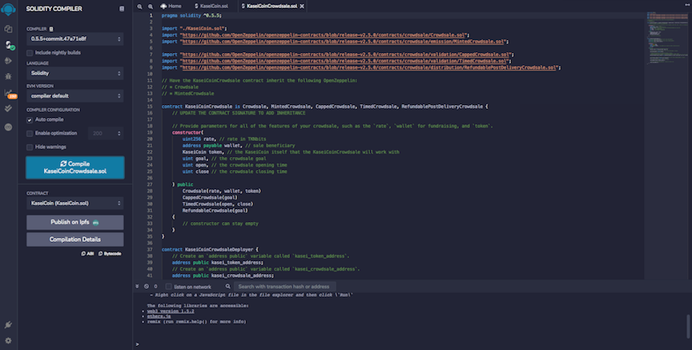

<!-- header is made with: https://github.com/kyechan99/capsule-render -->

[John Sung](https://linkedin.com/in/john-sung-3675569) 
                                 
---

### Table of Contents

* [Overview](#overview)
* [Requirements](#requirements)
* [Evaluation Evidence](#evaluation-evidence)
* [User Experience](#user-experience)
* [License](#license)  

---

## Overview

We created a fungible token called to kaseiCoin that is ERC-20 compliant for a Crowdsale contract from the OpenZeppelin Solidity library. You will learn to deploy three contracts to manage the entire crowdsale process.

---

## Requirements

This project leverages python version 3.7.11 with the following packages and modules:

- Solidity - Create the smart contract and implement the joints saving application to work with ether.

- Remix IDE - Write and edit solidity code to create the contracts

- MetaMask - Use digital wallet and a gateway for the Ethereum blockchain.

- Ganache - This is a tool that allows us to quickly set up a local blockchain, which we can use to test and develop smart contracts.

- OpenZeppelin - OpenZeppelin library provides a wide variety of contracts that are related to the ERC-20 token standard.

---

## Evaluation Evidence

### Step 1: Screenshot of the successful compilation of the kaseiCoin contract:

### Step 2: Screenshot of the successful compilation of the kaseiCoinCrowdsale contract:

### Step 3: Screenshot of the successful compilation of the kaseiCoinCrowdsaleDeployer contract:

### Step 4: KaseiCoinCrowdsaleDeployer Contract Demo

### Step 5: KaseiCoinCrowdsale Contract Demo

### Step 6: Compile KaseiCoinCrowdsaleDeployer Contract Demo

---

## License

MIT License

Copyright (c) 2022 John Sung

Permission is hereby granted, free of charge, to any person obtaining a copy
of this software and associated documentation files (the "Software"), to deal
in the Software without restriction, including without limitation the rights
to use, copy, modify, merge, publish, distribute, sublicense, and/or sell
copies of the Software, and to permit persons to whom the Software is
furnished to do so, subject to the following conditions:

The above copyright notice and this permission notice shall be included in all
copies or substantial portions of the Software.

THE SOFTWARE IS PROVIDED "AS IS", WITHOUT WARRANTY OF ANY KIND, EXPRESS OR
IMPLIED, INCLUDING BUT NOT LIMITED TO THE WARRANTIES OF MERCHANTABILITY,
FITNESS FOR A PARTICULAR PURPOSE AND NONINFRINGEMENT. IN NO EVENT SHALL THE
AUTHORS OR COPYRIGHT HOLDERS BE LIABLE FOR ANY CLAIM, DAMAGES OR OTHER
LIABILITY, WHETHER IN AN ACTION OF CONTRACT, TORT OR OTHERWISE, ARISING FROM,
OUT OF OR IN CONNECTION WITH THE SOFTWARE OR THE USE OR OTHER DEALINGS IN THE
SOFTWARE.

---
